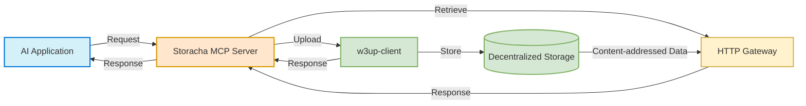

# Storacha MCP Server Spec

## Overview

This document outlines the specification for implementing a Model Context Protocol (MCP) server for Storacha storage. This MCP server will provide a standardized interface for AI models and applications to interact with Storacha's decentralized storage.

## Key Concepts

An MCP server provides a standardized way for AI applications to discover and use external tools and resources. For Storacha, this means:

- AI models can securely access Storacha's decentralized storage
- Applications can store and retrieve data without custom integration code
- The MCP standard ensures compatibility with a growing ecosystem of clients

## Storacha MCP Server Architecture

### Basic Flow



### Core Functionality

The Storacha MCP server will support three primary operations in this first iteration:

1. **Upload**: Store files on Storacha's decentralized storage using the Storacha client
2. **Retrieve**: Get files from Storacha by their root CID through the Storacha HTTP trustless Gateway
3. **Identity**: Get the DID key of the Storacha agent loaded from the private key storage config
4. **Authentication & Authorization**: Optional authentication via bearer tokens

#### MCP Did Key

#### UCAN Auth

#### Upload Operation

- **Single File Support**: The upload operation can handle one in a single request
- **Universal File Types**: Supports any file type, which is automatically converted to a blob by the Storacha client
- **Content Addressing**: Returns root CIDs for uploaded files, enabling permanent, verifiable references
- **Space Delegation**: Files are uploaded to the space authorized by the provided delegation in the server configuration
- **Flexible Space Delegation**: Can accept delegation proof in the request body, with request-level delegation taking priority over server configuration. If no delegation is provided in the request, the server will use the delegation from the DELEGATION environment variable. If no delegation is provided, then the upload operation will fail.
- **Filecoin Publishing**: Optional publishing to the Filecoin network
  - When `publishToFilecoin` is `true`, content is published to the Filecoin network, making it publicly accessible
  - When `publishToFilecoin` is `false` (default), content remains private within the Storacha network
  - Content is always accessible through its root CID, but Filecoin publishing affects its availability in the broader Filecoin network

#### Retrieve Operation

- **Root-Based Access**: Files are retrieved using their root CID from the upload operation
- **Gateway Access**: Retrieval happens through the Storacha HTTP trustless gateway (https://storacha.link) rather than the client instance, but the users can provide a custom gateway in the server configuration if needed
- **Format Conversion**: Files are returned in a format compatible with the MCP specification (base64 data URIs)
- **Metadata Preservation**: Content types and other metadata are preserved and returned with the file
- **Public Access**: No authentication required for retrieval, as root CIDs are self-authenticating

#### Identity Operation

- **Agent DID Retrieval**: Returns the DID key of the Storacha agent loaded from the private key storage config
- **No Parameters Required**: Simple operation that doesn't require any input parameters
- **Error Handling**: Provides clear error messages for missing or invalid private keys
- **Standard Response Format**: Returns the DID in a standardized JSON format
- **Private Key Dependency**: Requires a valid private key to be configured in the storage config

#### Authentication & Authorization

- **UCAN Authentication**: Uses User Controlled Authorization Networks (UCAN) for decentralized authentication and authorization
  - Delegations are provided as UCAN proofs
  - Supports hierarchical delegation chains
  - Enables fine-grained access control through capability-based permissions
- **Bearer Token Authentication**: Optional API key authentication using bearer tokens to control access to the upload operation
- **Delegation Priority**: Runtime delegations provided in requests take precedence over server pre defined delegation configuration
- **Flexible Authentication**: Can operate with or without authentication depending on use case and server configuration

#### MCP Compliance

- **Discovery Endpoint**: Implements the `.well-known/mcp.json` endpoint for client discovery
- **Standard Tool Format**: Operations are exposed as MCP tools with standard parameter schemas
- **Schema Validation**: All parameters are validated using Zod schemas
- **Consistent Error Handling**: Standardized error responses following the MCP format

## Requirements

### Server Configuration

The Storacha MCP server requires the following configuration:

- **MCP_SERVER_PORT**: Port to run the server on (default: 3001)
- **MCP_SERVER_HOST**: Host to bind to (default: '0.0.0.0')
- **MCP_CONNECTION_TIMEOUT**: Connection timeout in milliseconds (default: 30000)
- **MCP_TRANSPORT_MODE**: Transport mode to use (stdio or sse) (default: stdio)
- **SHARED_ACCESS_TOKEN**: Optional access token used to authenticate upload operations (if not set, authentication is disabled)
- **PRIVATE_KEY**: Required - Agent private key for w3up-client (for default delegation)
- **DELEGATION**: Required - The base64 encoded delegation that authorizes the Agent owner of the private key to upload files
- **GATEWAY_URL**: Custom gateway URL for file retrieval (default: 'https://storacha.link')
- **MAX_FILE_SIZE**: Maximum file size in bytes (default: 104857600 - 100MB)

### Storage Client

The server needs to interface with Storacha storage via:

1. **w3up-client/storacha-client**: For uploading files to the Storacha Network and managing spaces
2. **HTTP Trustless Gateway**: For retrieving files by CID

### MCP Transport Options

The Model Context Protocol (MCP) is transport-agnostic, meaning it can operate over different communication channels. The Storacha MCP server supports two transport modes:

1. **Server-Sent Events (SSE)**: One-way, server-to-client streaming
   - Pros: 
     - Real-time updates for file operation status
     - Lower latency for status notifications
     - Compatible with web browsers and HTTP clients
   - Cons: 
     - One-way communication only
     - Requires HTTP server setup
   - Best for: 
     - Web-based integrations
     - Real-time status updates
     - Browser-based clients

2. **Standard I/O (stdio)**: Communication through process streams
   - Pros: 
     - No network setup required
     - Simple for local tools and CLI applications
     - Direct process-to-process communication
   - Cons: 
     - Limited to local machine
     - No network access
   - Best for: 
     - CLI tools
     - Local development
     - Process integration

The server can be configured to use either transport mode via the `MCP_TRANSPORT_MODE` environment variable:
- `sse`: Uses Express with SSE for HTTP-based communication
- `stdio`: Uses standard I/O streams for local communication

The SSE implementation includes:
- Express server for HTTP handling
- CORS configuration for web access
- Temporary session-based message routing
- Connection timeout management
- Health check endpoint

The stdio implementation provides:
- Direct process communication
- Simple message passing
- No network dependencies
- Easy local testing

## MCP Server Implementation

The Storacha MCP server utilizes the latest [MCP TypeScript SDK](https://github.com/modelcontextprotocol/typescript-sdk), which provides a framework for creating MCP-compliant servers. This section outlines some implementation details based on the most recent SDK version.

### SSE Server Setup

The SSE server implementation consists of the following components:

1. **Server Configuration**
   - Express application for HTTP server functionality
   - CORS enabled with appropriate headers for web access
   - OPTIONS request handling for preflight requests
   - Connection timeout configuration (default: 30 seconds)
   - Configurable via `MCP_CONNECTION_TIMEOUT` environment variable

2. **Connection Management**
   - Maintains an in memory Map of active connections using session IDs
   - Each connection is associated with a unique SSEServerTransport instance
   - Automatic cleanup of closed connections
   - Idle connections are terminated after timeout period

3. **Endpoints**
   - `/sse`: Establishes SSE connections
     - Sets appropriate SSE headers (Content-Type, Cache-Control, Connection)
     - Creates and stores new transport instance
     - Handles connection closure
     - Connects transport to MCP server
   
   - `/messages`: Handles client-to-server communication
     - Routes messages to appropriate transport based on session ID
     - Processes messages through the connected transport
   
   - `/health`: Provides server status information
     - Reports server initialization state
     - Shows active connection count
     - Lists connected session IDs
   
   - `/`: Root endpoint with basic server information
     - Server name and version
     - Available endpoints
     - Current server status
     - Active connection count

4. **Server Startup**
   - Binds to configured host and port
   - Sets connection timeout from configuration
   - Logs server startup information

### Stdio Server Setup

The stdio server implementation consists of the following components:

1. **Server Configuration**
   - Direct process-to-process communication using standard I/O streams
   - No network dependencies or HTTP server required
   - Simple message passing interface
   - Connection timeout configuration (default: 30 seconds)
   - Configurable via `MCP_CONNECTION_TIMEOUT` environment variable

2. **Connection Management**
   - Single persistent connection through stdin/stdout
   - No need for session tracking or connection cleanup
   - Direct message routing to MCP server
   - Process-level communication
   - Idle connections are terminated after timeout period

3. **Message Handling**
   - Reads JSON-RPC messages from stdin
   - Processes messages through MCP server
   - Writes responses to stdout
   - Maintains message order through stream processing
   - Timeout handling for long-running operations

4. **Server Startup**
   - Initializes stdio transport
   - Connects transport to MCP server
   - Sets connection timeout from configuration
   - Logs server startup information
   - Ready to process messages from stdin

### Error Handling

The MCP SDK uses a standardized error handling approach with the following format:

```typescript
// Error response format
{
  content: [{ 
    type: "text", 
    text: "Error message here" 
  }],
  isError: true
}
```

This format allows clients to easily identify errors and display appropriate messages to users. The server handles several types of errors:

1. **Authentication Errors**: When the provided token doesn't match the configured token
2. **Delegation Errors**: When an invalid delegation is provided
3. **Validation Errors**: When parameters fail validation (handled automatically by Zod)
4. **Storage Errors**: When the underlying storage operations fail
5. **Gateway Errors**: When the HTTP gateway can't retrieve the requested file
6. **Size Limit Errors**: When files exceed the configured size limit

All errors are consistently formatted to follow the MCP specification, including the appropriate HTTP status codes for transport-level errors.

## Handling Large File Uploads

The server implements the following mechanisms to handle large file uploads:

1. **File Size Limits**
   - Default maximum file size: 100MB (104857600 bytes)
   - Configurable via `MAX_FILE_SIZE` environment variable
   - Size validation occurs before processing to prevent server overload
   - Returns standardized MCP error format when size limit is exceeded

2. **Connection Timeouts**
   - Default connection timeout: 30 seconds
   - Configurable via `MCP_CONNECTION_TIMEOUT` environment variable
   - Applies to both SSE and stdio transports
   - Idle connections are automatically terminated

3. **Error Handling**
   - Standardized MCP error responses for size-related issues
   - Clear error messages indicating size limits
   - Proper HTTP status codes for transport errors
   - Graceful handling of connection timeouts

Note: The following features are planned for future implementation:
- Stream-based processing for large files
- Chunked upload support
- Memory management optimizations

## Client Integrations

The Storacha MCP server can be integrated with various client applications using the HTTP transport.

### Integration Patterns

1. **Direct SDK Integration**: Applications can use the MCP client SDK (available in TypeScript, Python, and other languages) with the HTTP transport to connect directly to the Storacha MCP server.

2. **AI Agent Framework Integration**: AI agent frameworks like LangChain, AutoGPT, and others can integrate with the Storacha MCP server as a tool or plugin.

3. **LLM Application Integration**: Applications built around LLMs (like Claude, ChatGPT, etc.) can connect to the Storacha MCP server through their native MCP support.

4. **Custom API Integration**: Developers can build custom integrations by directly communicating with the MCP server endpoints without using the official SDKs.

### Integration Process

Regardless of the approach, integration typically follows these steps:

1. **Client Initialization**: Configure the client with the Storacha MCP server URL and authentication if required.

2. **Transport Selection**: Choose the appropriate transport mode:
   - For web-based clients: Use SSE transport with `/sse` and `/messages` endpoints
   - For local tools: Use stdio transport for direct process communication

3. **Operation Invocation**: Call the upload or retrieve operations with appropriate parameters:
   - For SSE transport: Send JSON-RPC messages to `/messages` endpoint
   - For stdio transport: Send JSON-RPC messages through stdin

4. **Response Processing**: Handle the standardized responses returned by the MCP server, including proper error handling.

> Note: Detailed code examples for client integrations can be found in the separate `client-integrations.md` document.

## Deployment Options

The Storacha MCP server can be deployed using various approaches:

1. **Docker Container**: Package the server for consistent deployment across environments
2. **Serverless Function**: Deploy as a serverless function for automatic scaling and reduced operational overhead
3. **Traditional Host**: Run on a standard server or VPS for maximum control
4. **NPM Package**: Distribute as an npm package for easy installation by developers

> Note: Detailed deployment instructions can be found in the separate `distribution.md` document.

## Security

The Storacha MCP server implements these security measures:

1. **Authentication**
   - Private key authentication for storage operations
   - Delegation proof validation for storage access
   - Optional shared access token for API access

2. **Delegation Requirements**
   - A delegation proof is required for all upload operations
   - Delegation can be provided in two ways:
     - Via the `DELEGATION` environment variable (server-wide setting)
     - Via the `delegation` parameter in the upload request (per-request setting)
   - At least one delegation source must be provided
   - Request-level delegation takes precedence over environment variable delegation

3. **CORS Configuration**
   - Configurable CORS settings for web access
   - Preflight request handling
   - Secure header management
