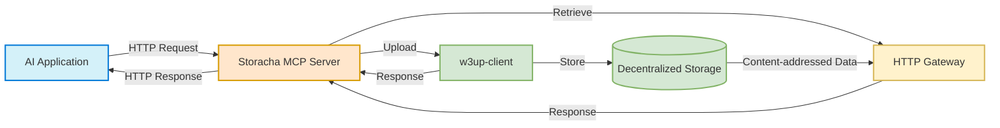

# Storacha MCP Server Spec

## Overview

This document outlines the specification for implementing a Model Context Protocol (MCP) server for Storacha storage. This MCP server will provide a standardized interface for AI models and applications to interact with Storacha's decentralized storage capabilities using a simple HTTP-based approach.

## Key Concepts

An MCP server provides a standardized way for AI applications to discover and use external tools and resources. For Storacha, this means:

- AI models can securely access Storacha's decentralized storage
- Applications can store and retrieve data without custom integration code
- The MCP standard ensures compatibility with a growing ecosystem of clients

## Storacha MCP Server Architecture

### Basic Flow



### Core Functionality

The Storacha MCP server will support two primary operations in this first iteration:

1. **Upload**: Store files on Storacha's decentralized storage using the Storacha client
2. **Retrieve**: Get files from Storacha by their Content ID (CID) through the Storacha HTTP trustless Gateway
3. **Authentication & Authorization**: Optional authentication via bearer tokens

#### Upload Operation

- **Multiple File Support**: The upload operation can handle one or more files in a single request
- **Universal File Types**: Supports any file type, which is automatically converted to a blob by the Storacha client
- **Content Addressing**: Returns Content IDs (CIDs) for uploaded files, enabling permanent, verifiable references
- **Space Delegation**: Files are uploaded to the space authorized by the provided delegation in the server configuration
- **Flexible Space Delegation**: Can accept delegation proof in request headers or body, with runtime delegations taking priority over server configuration

#### Retrieve Operation

- **CID-Based Access**: Files are retrieved using their unique Content IDs (CIDs)
- **Gateway Access**: Retrieval happens through the Storacha HTTP trustless gateway (https://storacha.link) rather than the client instance, but the users can provide a custom gateway in the server configuration if needed
- **Format Conversion**: Files are returned in a format compatible with the MCP specification (base64 data URIs)
- **Metadata Preservation**: Content types and other metadata are preserved and returned with the file
- **Public Access**: No authentication required for retrieval, as CIDs are self-authenticating

#### Authentication & Authorization

- **Bearer Token Authentication**: Optional API key authentication using bearer tokens to control access to the upload operation
- **Delegation Priority**: Runtime delegations provided in requests take precedence over server pre defined delegation configuration
- **Flexible Authentication**: Can operate with or without authentication depending on use case and server configuration

#### MCP Compliance

- **Discovery Endpoint**: Implements the `.well-known/mcp.json` endpoint for client discovery
- **Standard Tool Format**: Operations are exposed as MCP tools with standard parameter schemas
- **Schema Validation**: All parameters are validated using Zod schemas
- **Consistent Error Handling**: Standardized error responses following the MCP format

## Requirements

### Server Configuration

The Storacha MCP server requires the following configuration:

- **SHARED_ACCESS_TOKEN**: Optional access token used to authenticate upload operations (if not set, authentication is disabled)
- **PRIVATE_KEY**: Agent private key for w3up-client (for default delegation)
- **DELEGATION**: Default delegation authorized to store content
- **PORT**: Port to run the server on (default: 3000)
- **HOST**: Host to bind to (default: '0.0.0.0')
- **GATEWAY_URL**: Custom gateway URL (default: 'https://storacha.link')
- **MAX_FILE_SIZE_MB**: Maximum file size in MB (default: 100MB)
  - TODO: double check this limitation in the Storacha client

### Storage Client

The server needs to interface with Storacha storage via:

1. **w3up-client/storacha-client**: For uploading files to the Storacha Network and managing spaces
2. **HTTP Trustless Gateway**: For retrieving files by CID

### MCP Transport Options

The Model Context Protocol (MCP) is transport-agnostic, meaning it can operate over different communication channels. The MCP TypeScript SDK provides several transport options:

1. **HTTP Transport**: Using an HTTP server like Express to handle network requests
   - Pros: Widely compatible, stateless, familiar to developers
   - Cons: Higher latency for frequent communications
   - Best for: Public-facing API servers, RESTful integrations

2. **Server-Sent Events (SSE)**: One-way, server-to-client streaming
   - Pros: Lower latency, real-time updates
   - Cons: More complex, one-way communication
   - Best for: Scenarios requiring real-time updates

3. **Standard I/O (stdio)**: Communication through process streams
   - Pros: No network needed, simple for local tools
   - Cons: Only works locally, not for networked applications
   - Best for: CLI tools, local agent integration

4. **WebSockets**: Bi-directional, persistent connections
   - Pros: Low latency, bi-directional communication
   - Cons: More complex, requires persistent connections
   - Best for: Highly interactive applications

For the Storacha MCP server, we can use HTTP transport with Express for several reasons:
- File uploads and retrievals are typically one-time operations, not requiring persistent connections
- HTTP is widely supported across all platforms
- RESTful endpoints are easy to secure, route, and scale
- The implementation is simpler and easier to maintain

Any objections?

The implementation uses Express to handle the HTTP layer while delegating the MCP-specific logic to the `McpServer` class from the MCP TypeScript SDK.

## MCP Server Implementation

The Storacha MCP server utilizes the latest [MCP TypeScript SDK](https://github.com/modelcontextprotocol/typescript-sdk), which provides a framework for creating MCP-compliant servers. This section outlines some implementation details based on the most recent SDK version.

### Server Setup

```typescript
import { McpServer } from "@modelcontextprotocol/sdk/server/mcp.js";
import express from "express";
import { z } from "zod";
import { StorageClient } from "./storage-client.js";
import { config } from "./config.js";

// Initialize storage client with configuration
const storage = new StorageClient({
  privateKey: config.PRIVATE_KEY,
  delegation: config.DELEGATION,
  gatewayUrl: config.GATEWAY_URL || 'https://storacha.link'
});

// Create Express app for HTTP server functionality
// Express handles HTTP routing, CORS, body parsing, etc.
const app = express();
app.use(express.json({ limit: config.MAX_FILE_SIZE_MB || '100mb' }));

// Enable CORS for client connections
app.use((req, res, next) => {
  res.header('Access-Control-Allow-Origin', '*');
  res.header('Access-Control-Allow-Headers', 'Origin, X-Requested-With, Content-Type, Accept, Authorization');
  if (req.method === 'OPTIONS') {
    res.header('Access-Control-Allow-Methods', 'GET, POST, HEAD');
    return res.status(200).json({});
  }
  next();
});

// Create MCP server instance to handle MCP protocol logic
// This processes JSON-RPC messages but doesn't handle networking
const server = new McpServer({
  name: "Storacha MCP Storage Server",
  version: "1.0.0",
  description: "Distributed storage for AI systems via the Storacha Network",
  contactInfo: {
    name: "Storacha Support",
    url: "https://storacha.ai/support"
  }
});

// Register tools (capabilities) with the MCP server
server.tool(
  "upload",
  {
    file: z.string().describe('The file to upload (binary data or base64 encoded string)'),
    name: z.string().optional().describe('Name for the uploaded file'),
    delegation: z.object({}).optional().describe('Optional delegation proof for authorization')
  },
  async ({ file, name = 'unnamed-file', delegation }, context) => {
    try {
      // Validate authentication if access token is configured
      
      // If delegation is provided in the request, use it
      
      // Validate file size
      
      // Upload the file
      
      // Return the response
      return {
        content: [{ 
          type: "text", 
          text: JSON.stringify({
            cid: result.cid,
            size: result.size,
            url: `${config.GATEWAY_URL || 'https://storacha.link'}/ipfs/${result.cid}`
          })
        }]
      };
    } catch (error) {
      console.error('Upload error:', error);
      
      return {
        content: [{ 
          type: "text", 
          text: `Upload failed: ${error.message}` 
        }],
        isError: true
      };
    }
  }
);

server.tool(
  "retrieve",
  {
    cid: z.string().describe('The Content ID (CID) of the file to retrieve')
  },
  async ({ cid }) => {
    try {
      // Validate CID format
      
      // Retrieve file from gateway
      try {
        // Return the response
        return {
          content: [{ 
            type: "text", 
            text: JSON.stringify({
              data: result.data,
              contentType: result.contentType
            })
          }]
        };
      } catch (fetchError) {
        return {
          content: [{ 
            type: "text", 
            text: `Gateway connection failed: ${fetchError.message}` 
          }],
          isError: true
        };
      }
    } catch (error) {
      console.error('Retrieve error:', error);
      
      return {
        content: [{ 
          type: "text", 
          text: `Retrieval failed: ${error.message}` 
        }],
        isError: true
      };
    }
  }
);

// Discovery endpoint - Express routes the request, MCP server provides the data
app.get('/.well-known/mcp.json', (req, res) => {
  return res.json(server.getDiscoveryDocument());
});

// MCP endpoint for tool invocations - Express handles HTTP, MCP server processes the request
app.post('/mcp', async (req, res) => {
  try {
    // Use the MCP server to process the JSON-RPC request
    const result = await server.processRequest(req.body);
    return res.json(result);
  } catch (error) {
    console.error('Error handling request:', error);
    return res.status(500).json({
      error: 'Internal server error',
      message: error.message
    });
  }
});

// Add a health check endpoint
app.get('/health', (req, res) => {
  res.status(200).json({ status: 'ok' });
});

// Start the Express HTTP server to listen for incoming requests
app.listen(config.PORT || 3000, config.HOST || '0.0.0.0', () => {
  console.log(`Storacha MCP server running on port ${config.PORT || 3000}`);
  console.log(`MCP endpoint available at http://${config.HOST || '0.0.0.0'}:${config.PORT || 3000}/mcp`);
});
```

### Error Handling

The MCP SDK uses a standardized error handling approach with the following format:

```typescript
// Error response format
{
  content: [{ 
    type: "text", 
    text: "Error message here" 
  }],
  isError: true
}
```

This format allows clients to easily identify errors and display appropriate messages to users. The server handles several types of errors:

1. **Authentication Errors**: When the provided token doesn't match the configured token
2. **Delegation Errors**: When an invalid delegation is provided
3. **Validation Errors**: When parameters fail validation (handled automatically by Zod)
4. **Storage Errors**: When the underlying storage operations fail
5. **Gateway Errors**: When the HTTP gateway can't retrieve the requested file
6. **Size Limit Errors**: When files exceed the configured size limit

All errors are consistently formatted to follow the MCP specification, including the appropriate HTTP status codes for transport-level errors.

### Discovery Endpoint

The MCP server provides a discovery endpoint at `.well-known/mcp.json` that allows clients to discover available tools. This endpoint returns a JSON document describing the server and its available tools:

```json
{
  "name": "Storacha MCP Storage Server",
  "version": "1.0.0",
  "description": "Decentralized storage for AI systems via the Storacha network",
  "contactInfo": {
    "name": "Storacha Support",
    "url": "https://storacha.ai/support"
  },
  "tools": [
    {
      "name": "upload",
      "description": "Upload a file to Storacha storage",
      "parameters": {
        ...
      }
    },
    {
      "name": "retrieve",
      "description": "Retrieve a file from Storacha storage by CID",
      "parameters": {
        ...
      }
    }
  ]
}
```

## Handling Large File Uploads

For handling large file uploads, the server includes:

1. **Increased JSON Body Limit**: The Express app is configured with a 100MB limit by default for JSON payloads - or the limit can be configured via `MAX_FILE_SIZE_MB` environment variable
2. **File Size Validation**: File size is validated before processing to prevent server overload
  - TODO: double check if the use only the express max file config (how to handle the error and return the proper format?)
  - TODO: Validate if with MotherDAO folks need to upload extremely large files
3. **Timeouts**: Server-side timeouts can be configured for large file uploads

## Client Integrations

The Storacha MCP server can be integrated with various client applications using the HTTP transport.

### Integration Patterns

1. **Direct SDK Integration**: Applications can use the MCP client SDK (available in TypeScript, Python, and other languages) with the HTTP transport to connect directly to the Storacha MCP server.

2. **AI Agent Framework Integration**: AI agent frameworks like LangChain, AutoGPT, and others can integrate with the Storacha MCP server as a tool or plugin.

3. **LLM Application Integration**: Applications built around LLMs (like Claude, ChatGPT, etc.) can connect to the Storacha MCP server through their native MCP support.

4. **Custom API Integration**: Developers can build custom integrations by directly communicating with the MCP server endpoints without using the official SDKs.

### Integration Process

Regardless of the approach, integration typically follows these steps:

1. **Client Initialization**: Configure the client with the Storacha MCP server URL and authentication if required.

2. **Tool Discovery**: Use the `.well-known/mcp.json` endpoint to discover available tools and their parameter schemas.

3. **Operation Invocation**: Call the upload or retrieve operations with appropriate parameters.

4. **Response Processing**: Handle the standardized responses returned by the MCP server, including proper error handling.

> Note: Detailed code examples for client integrations can be found in the separate `client-integrations.md` document.

## Deployment Options

The Storacha MCP server can be deployed using various approaches:

1. **Docker Container**: Package the server for consistent deployment across environments
2. **Serverless Function**: Deploy as a serverless function for automatic scaling and reduced operational overhead
3. **Traditional Host**: Run on a standard server or VPS for maximum control
4. **NPM Package**: Distribute as an npm package for easy installation by developers

> Note: Detailed deployment instructions can be found in the separate `distribution.md` document.
